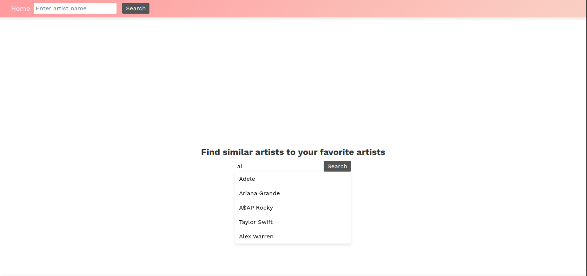
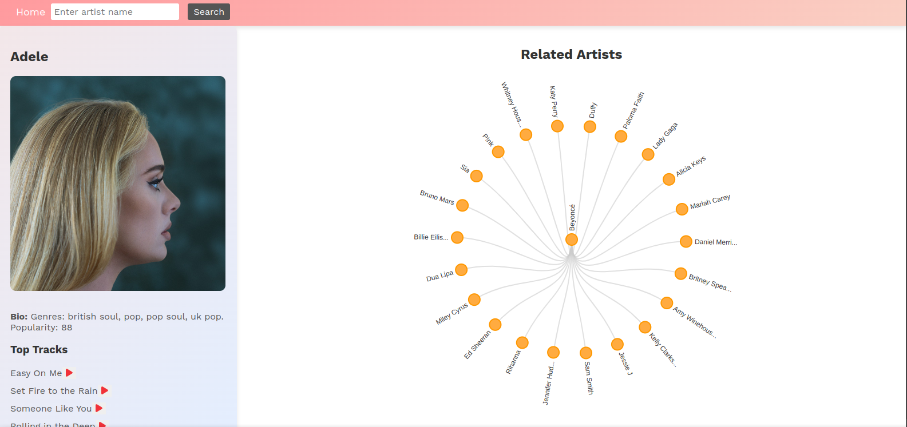
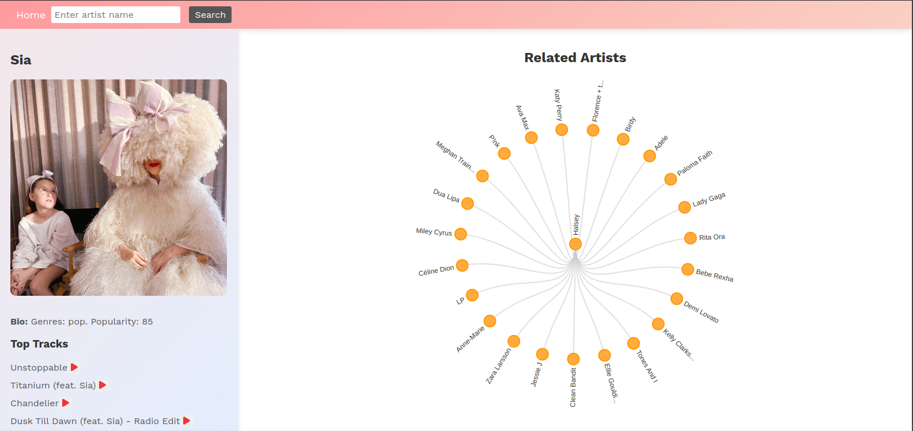

## Frontend of the Project

The project uses React JS for frontend
It uses D3.js for visualization

## How to use Buzzd

## 1. Search for and artist

For example, Adele

The app will display Adele's bio, top tracks, and related artists

## 2. Find more artists

You can then click on either of the artists for more recommendations.
For example, if you click Sia, you get the following:

Enjoy!!!